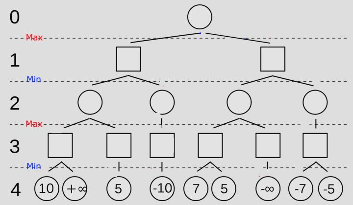
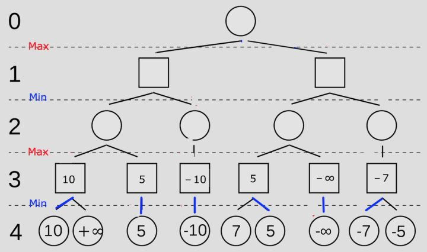
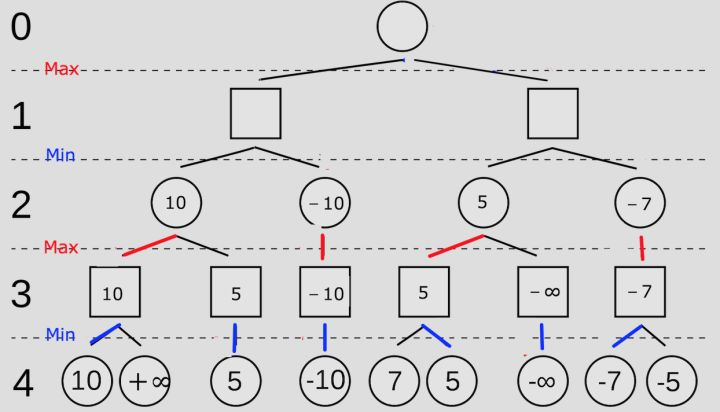
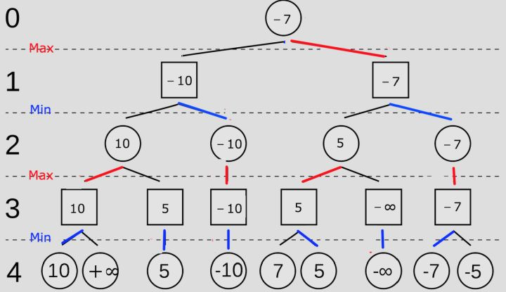

# 背景介绍

## 博弈树

* 博弈的初始格局是初始节点
* 在博弈树中，双方轮流扩展节点，假设有两方博弈，若A先走则成处于奇数深度的节点都应由A走，所有偶数级都应该由B走。

    > 说白了博弈树就是对于棋盘状况的一种穷举！

## MiniMAX算法

 Minimax算法又名极小化极大算法，是一种找出失败的最大可能性中的最小值的算法。Minimax算法常用于棋类等由两方较量的游戏和程序，这类程序由两个游戏者轮流，每次执行一个步骤。我们众所周知的五子棋、象棋等都属于这类程序，所以说Minimax算法是基于搜索的博弈算法的基础。该算法是一种零总和算法，即一方要在可选的选项中选择将其优势最大化的选择，而另一方则选择令对手优势最小化的方法。
 
 * Minimax是一种悲观算法，即假设对手每一步都会将我方引入从当前看理论上价值最小的格局方向，即对手具有完美决策能力。因此我方的策略应该是选择那些对方所能达到的让我方最差情况中最好的，也就是让对方在完美决策下所对我造成的损失最小。
 
 * Minimax不找理论最优解，因为理论最优解往往依赖于对手是否足够愚蠢，Minimax中我方完全掌握主动，如果对方每一步决策都是完美的，则我方可以达到预计的最小损失格局，如果对方没有走出完美决策，则我方可能达到比预计的最悲观情况更好的结局。总之我方就是要在最坏情况中选择最好的。
 
 假设我们有如下图的游戏，我是先手，我应该如何利用Minmax算法来选出第一步怎么走呢？

 

 1. 这个时候我们就要从结果看起，也就是第4步。图中标注第四步是我的对手下的，所以他要做的是最小化这个分数，于是对手根据结果可以反推出如下选择，对手选择使我的得分最小的分数：

 

 2. 继续从后往前看到第3步，当我们知道了对手的选择以后，我们可以根据对手的结果反推出自己的选择，我们要做的是最大化这个分数，如图
 
 

 3. 重复这个步骤，我们最终可以发现第一步的最优选择，如图

 

# 问题：

 如果这个游戏每一步都有n个选择，那么在x步以后，将会有n^x个选择。这个时候，我们就需要采取剪枝算法（Alpha-Beta）来减少运算量。从剪枝算法这个名字我们就能看出，这个算法能让我们剪掉树状图中的一些分支，从而减少运算量。即使如此，如果想把 Minimax 搜索运用到象棋或者五子棋，围棋上，仍然会遇到两个大问题：

* 搜索树太广,棋盘太大了，每一方在每一步都有很多着法可选。
* 很难评估胜率。除非把搜索树走到终局，这意味着要走够三百多步（因为对于电脑来说，甚至很难判断何时才是双方都同意的终局，所以只能傻傻地填子，一直到双方都真的没地方可以走为止）。简单地说，搜索树也需要特别深

## 蒙特卡洛树搜索

蒙特卡洛树搜索的意义在于部分解决了上述两个问题：
* 它可以给出一个局面评估，虽然不准，但比没有强。这就部分解决了第二个问题。
* 根据它的设计，搜索树会较好地自动集中到“更值得搜索的变化”（注意，也不一定准）。如果发现一个不错的着法，蒙特卡洛树搜索会较快地把它看到很深，可以说它结合了广度优先搜索和深度优先搜索，类似于启发式搜索。这就部分解决了第一个问题。
* 最后，随着搜索树的自动生长，蒙特卡洛树搜索可以保证在足够长的时间后收敛到完美解（但可能需要极长的时间）。

