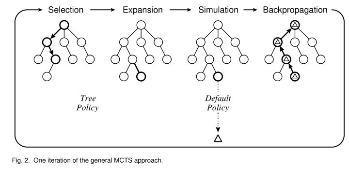
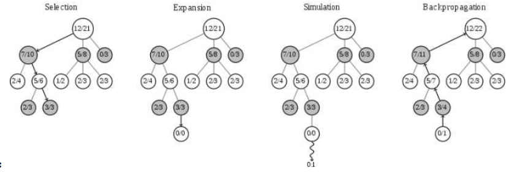

# 蒙特卡罗树搜索算法是干什么用的？

蒙特卡罗树搜索算法是一种方法（或者说框架），用于解决完美信息博弈;

    > perfect information games (完美信息)博弈，指的是没有任何信息被隐藏的游戏.

# 什么是蒙特卡洛树搜索算法？

蒙特卡洛树搜索（MCTS）是一种在人工智能问题中进行决策优化的方法，通常是对于那些在组合游戏中需要移动规划的部分。蒙特卡洛树搜索将随机模拟的通用性与树搜索的准确性进行了结合。

冯·诺依曼于 1928 年提出的极小化极大理论（minimax）为之后的对抗性树搜索方法铺平了道路，而这些在计算机科学和人工智能刚刚成立的时候就成为了决策理论的根基。蒙特卡洛方法通过随机采样解决问题，随后在 20 世纪 40 年代，被作为了一种解决模糊定义问题而不适合直接树搜索的方法。Rémi Coulomb 于 2006 年将这两种方法结合，来提供一种新的方法作为围棋中的移动规划，如今称为蒙特卡洛树搜索（MCTS）。

近期由于它在计算机围棋上的成果和对某些难题具有解决的潜力，科研领域对于 MCTS 的研究兴趣快速上升。它的应用领域已不止于博弈，而且理论上 MCTS 可以应用于任何能够以{状态，动作} 形式描述，通过模拟来预测结果的领域。


#基本算法
最基本的 MCTS 算法本身就是简单的：根据模拟出来的结果，建立一棵节点相连的搜索树。

 

1. 选择Selection

从根节点 R 开始，递归地选择最优子节点（下面会解释）直到一个叶子节点 L 为止。

2. 扩展Expansion

如果 L 不是终止节点（就是说，博弈尚未结束）那么就创建一个或多个子节点，并选择其中一个 C。

3. 模拟Simulation

从 C 执行一次模拟推出（译者注：通常称为 playout 或 rollout）直到得到一个结果。

4. 反向传播Backpropagation

用模拟出来的结果更新当前的移动序列。每一个节点必须包含两部分重要的信息：基于模拟所得结果的估值，和被访问的次数

> 在最简单和最大化利用内存的执行中，MCTS 会在每次迭代中添加一个子节点。注意，在某些情况下每次迭代增加多个子节点可能会更有益。

## 怎么选择节点
和从前一样：如果轮到黑棋走，就选对于黑棋有利的；如果轮到白棋走，就选对于黑棋最不利的。但不能太贪心，不能每次都只选择“最有利的/最不利的”，因为这会意味着搜索树的广度不够，容易忽略实际更好的选择。

因此，最简单有效的选择公式是这样的：

 

其中 x 是节点的当前胜率估计（注意，如前所述，要考虑当前是黑棋走还是白棋走！），N 是节点的访问次数。C 是一个常数。C 越大就越偏向于广度搜索，C 越小就越偏向于深度搜索。注意对于原始的 UCT 有一个理论最优的 C 值，但由于我们的目标并不是最小化“遗憾”，因此需要根据实际情况调参。

## 举一个实际例子（示意图有一些问题）



上图中每个节点代表一个局面。而 A/B 代表这个节点被访问 B 次，黑棋胜利了 A 次。例如一开始的根节点是 12/21，代表总共模拟了 21 次，黑棋胜利了 12 次。

我们看例子说明这是什么意思，就看之前的图吧。

1. 假设根节点是轮到黑棋走。那么我们首先需要在 7/10、5/8、0/3 之间选择：

* 7/10节点对应的分数为:


* 5/8 对应的分数为： 


* 0/3节点对应的分数为:


> 可以注意到，C越大，就会越照顾访问次数相对较少的子节点,如果 C 比较小，我们将会选择 7/10，接着就要在 2/4 和 5/6 间选择。

2. 由于现在是白棋走，需要把胜率估计倒过来，我们在实际实现的时候，可以将模拟的结果反向传播的时候，加一个 - ，就不需要下面这种方式算了：

* 2/4节点对应的分数为 :


*  5/6节点对应的分数为


下一步就应该走2/4节点；所以说之前的图是错误的，因为制图的人并没有注意到要把胜率倒过来（有朋友会说是不是可以认为它的白圈代表白棋的胜率，但这样它的回溯过程就是错的）

## 下面是一个MCTS的伪代码示意：

```
    mcts_tree = init_mcts_tree(current_board)   #根据当前局面，生成一个MTCS树
    #在规定的搜索时间或者次数内，通过不停的模拟对局，更新mcts_tree数据      
    for time in limit_time:                

         simulate_board = copy(board)  #复制一份当前的局面，作为模拟对面的局面
         
         node = mcts_tree.root_node    #每次都从根节点开始
     
         leaf_node  =  mcts_tree.selection(node)  #选择一个叶子节点，利用 UCB 公式计算每个子节点的 UCB 值，选择最大值的子节点

         mcts_tree.expansion(leaf_node)      #在该叶子节点，拓展获取新的叶子节点, 如拓展多个，就随机选择新的一个     
         leaf_value = mcts.simulation(simulate_board)  #进行模拟，并获得结果

         # 将模拟对局的收益（一般胜为 1 负为 0）按对应颜色更新该节点及各级祖先节点，同时增加该节点以上所有节点的访问次数
         mcts.backpropagation(leaf_node, leaf_value)  
   
     #根据模拟结果，从当前局面的子节点中挑选平均收益最高的给出最佳走法
     move = the_node_of_max_value(mcts_tree.root_node.children_node.value)   
```

