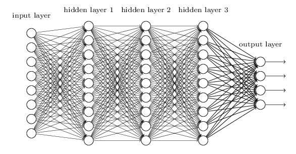
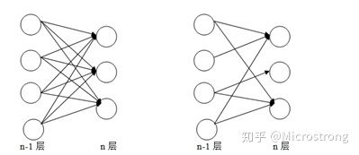

# 神经网络

## 人工神经网络ANN:
人工神经网络（ANN）是一种从信息处理角度对人脑神经元网络进行抽象从而建立的某种简单模型，按不同的连接方式组成不同的网络; 核心是多层感知器和反向传播算法

* 输入层 input layer
* 隐藏层 hidden layer : 由全连接层Affine + 激活层Relu 组成 
* 输出层 output layer ：由Affine + 分类器Softmax层 组成

## 典型的人工神经网络模型

input -> (Affine->ReLu) ->  (Affine->ReLu) ...->(Affine->Softmax)-> output

input -> (Affine->ReLu) ->  (Affine->ReLu) ...->(Affine->Softmax)-> output

## 卷积神经网络CNN：

相比普通的ANN网络，新增加了:
* covolutional layer卷积层
* pooling layer池化层

## 典型的卷积神经网络模型

input -> (Conv->Relu->Pooling) -> (Conv->Relu) -> (Affine->Relu) ->(Affine->Softmax) -> output

input -> (Conv->Relu->Pooling) -> (Conv->Relu) -> (Affine->Relu) ->(Affine->Softmax) -> output

## 卷积神经网络
目前CNN网络在图像，语音识别领域占主流位置，在图像识别的比赛中，基于深度学习的方法都是基于CNN。CNN相比ANN，部分差别（不全）：

* 部分连接，提取局部特征

* 不同的卷积核，作为不同的特征滤波器

* 空间共享，保留空间信息
