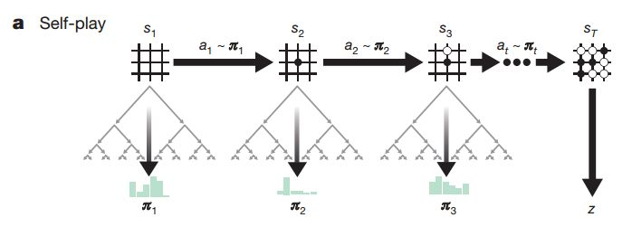
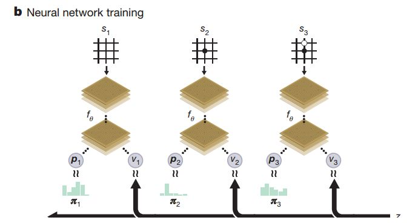

# AlphaZero原理

1、引入策略价值神经网络，这个策略价值网络实际包括两张人工神经网络：
* 策略网络（Policy Network），也称为走棋网络，给定当前局面，预测/采样下一步的走棋；传统的MCTS，expand树节点时候，采用简单的采用平均策略
* 估值网络（Value Network），给定当前局面，估计是白胜还是黑胜；传统的MCTS通过随机模拟对局，估算当前局面（扩展的子节点后的局面）的value

2、通过强化学习，也即是通过自我对弈进行神经网络的训练

## 自我对局（self-play）
在self-play过程中，我们会收集一系列的(s,pi,z)数据，s表示局面，pi是根据MCTS根节点处每个分支的访问次数计算的概率, z是self-play对局的结果，其中 pi 和 z 需要特别注意从每一步的当前player的视角去表示.

 

完全基于self-play来学习进化是AlphaZero的最大卖点，也是整个训练过程中最关键也是最耗时的环节。这里有几个关键点需要说明：

### 使用哪个模型来生成self-play数据？
在AlphaGo Zero版本中，我们需要同时保存当前最新的模型和通过评估得到的历史最优的模型，self-play数据始终由最优模型生成，用于不断训练更新当前最新的模型，然后每隔一段时间评估当前最新模型和最优模型的优劣，决定是否更新历史最优模型。

而到了AlphaZero版本中，这一过程得到简化，我们只保存当前最新模型，self-play数据直接由当前最新模型生成，并用于训练更新自身。直观上我们可能会感觉使用当前最优模型生成的self-play数据可能质量更高，收敛更好，但是在尝试过两种方案之后，我们发现，在6*6棋盘上下4子棋这种情况下，直接使用最新模型生成self-play数据训练的话大约500局之后就能得到比较好的模型了，而不断维护最优模型并由最优模型生成self-play数据的话大约需要1500局之后才能达到类似的效果，这和AlphaZero论文中训练34小时的AlphaZero胜过训练72小时的AlphaGo Zero的结果也是吻合的。个人猜测，不断使用最新模型来生成self-play数据可能也是一个比较有效的exploration手段，首先当前最新模型相比于历史最优模型一般不会差很多，所以对局数据的质量其实也是比较有保证的，同时模型的不断变化使得我们能覆盖到更多典型的数据，从而加快收敛。

### 如何保证self-play生成的数据具有多样性？
一个有效的策略价值模型，需要在各种局面下都能比较准确的评估当前局面的优劣以及当前局面下各个action的相对优劣，要训练出这样的策略价值模型，就需要在self-play的过程中尽可能的覆盖到各种各样的局面。前面提到，不断使用最新的模型来生成self-play数据可能在一定程度上有助于覆盖到更多的局面，但仅靠这么一点模型的差异是不够的，所以在强化学习算法中，一般都会有特意设计的exploration的手段，这是至关重要的。在AlphaGo Zero论文中，每一个self-play对局的前30步，action是根据正比于MCTS根节点处每个分支的访问次数的概率采样得到的,exploration则是通过直接加上Dirichlet noise的方式实现的
在我们的实现中，self-play的每一步都同时使用了这两种exploration方式

### 始终从当前player的视角去保存self-play数据
在self-play过程中，我们会收集一系列的 [s,pi,z] 数据， [s] 表示局面， [pi] 是根据MCTS根节点处每个分支的访问次数计算的概率， [z] 是self-play对局的结果，其中 [s] 和 [z] 需要特别注意从每一步的当前player的视角去表示。比如 [s] 中用两个二值矩阵分别表示两个player的棋子的位置，那么可以是第一个矩阵表示当前player的棋子位置，第二个矩阵表示另一个player的棋子位置，也就是说第一个矩阵会交替表示先手和后手player的棋子位置，就看 [s] 局面下谁是当前player。 [z] 也类似，不过需要在一个完整的对局结束后才能确定这一局中每一个 [s,pi,z] 中的 [s] ，如果最后的胜者是 [s] 局面下的当前player，则 [z=1] ,如果最后的败者是 [s] 局面下的当前player，则 [z=-1] ,如果最后打平，则 [z=0] .

### self-play数据的扩充
围棋具有旋转和镜像翻转等价的性质，其实五子棋也具有同样的性质。在AlphaGo Zero中，这一性质被充分的利用来扩充self-play数据，以及在MCTS评估叶子节点的时候提高局面评估的可靠性。但是在AlphaZero中，因为要同时考虑国际象棋和将棋这两种不满足旋转等价性质的棋类，所以对于围棋也没有利用这个性质。而在我们的实现中，因为生成self-play数据本身就是计算的瓶颈，为了能够在算力非常弱的情况下尽快的收集数据训练模型，每一局self-play结束后，我们会把这一局的数据进行旋转和镜像翻转，将8种等价情况的数据全部存入self-play的data buffer中。这种旋转和翻转的数据扩充在一定程度上也能提高self-play数据的多样性和均衡性。

## 策略价值网络训练

* 输入: 局面s
* 策略网络输出: pi每一个可行action的概率
* 价值网络输出: z当前局面评分的模型

策略价值网络，包括两张网络，一张是走棋网络（策略网络），一张是价值网络；
就是在给定当前局面s的情况下，返回当前局面下每一个可行action的概率以及当前局面评分的模型。前面self-play收集到的数据就是用来训练策略价值网络的，而训练更新的策略价值网络也会马上被应用到MCTS中进行后面的self-play，以生成更优质的self-play数据。两者相互嵌套，相互促进，就构成了整个训练的循环

 

### 局面描述方式

在AlphaGo Zero中，一共使用了17个s的二值特征平面来描述当前局面，其中前16个平面描述了最近8步对应的双方player的棋子位置，最后一个平面描述当前player对应的棋子颜色，其实也就是先后手。

在我们的实现中，对局面的描述进行了极大的简化，以8*8的棋盘为例，我们只使用了4个8*8的二值特征平面：
* 前两个平面分别表示当前player的棋子位置和对手player的棋子位置，有棋子的位置是1，没棋子的位置是0.
* 第三个平面表示对手player最近一步的落子位置，也就是整个平面只有一个位置是1，其余全部是0.
* 第四个平面，也就是最后一个平面表示的是当前player是不是先手player，如果是先手player则整个平面全部为1，否则全部为0.

 > 在最开始尝试的时候，我只用了前两个平面，也就是双方的棋子的位置，因为直观感觉这两个平面已经足够表达整个完整的局面了。但是后来在增加了后两个特征平面之后，训练的效果有了比较明显的改善。个人猜想，因为在五子棋中，我方下一步的落子位置往往会在对手前一步落子位置的附近，所以加入的第三个平面对于策略网络确定哪些位置应该具有更高的落子概率具有比较大的指示意义，可能有助有训练。同时，因为先手在对弈中其实是很占优势的，所以在局面上棋子位置相似的情况下，当前局面的优劣和当前player到底是先手还是后手十分相关，所以第四个指示先后手的平面可能对于价值网络具有比较大的意义。

### 网络结构
在AlphaGo Zero中，输入局面首先通过了20或40个基于卷积的残差网络模块，然后再分别接上2层或3层网络得到策略和价值输出，整个网络的层数有40多或80多层，训练和预测的时候都十分缓慢。

所以在我们的实现中，对这个网络结构进行了极大的简化，最开始是公共的3层全卷积网络，分别使用32、64和128个3*3的filter，使用ReLu激活函数。然后再分成policy和value两个输出，在policy这一端，先使用4个1*1的filter进行降维，再接一个全连接层，使用softmax非线性函数直接输出棋盘上每个位置的落子概率；在value这一端，先使用2个1*1的filter进行降维，再接一个64个神经元的全连接层，最后再接一个全连接层，使用tanh非线性函数直接输出[-1,1]之间的局面评分。整个策略价值网络的深度只有5~6层，训练和预测都相对比较快。

### 训练目标
前面提到，策略价值网络的输入是当前的局面描述s，输出是当前局面下每一个可行action的概率p 以及当前局面的评分v ，而用来训练策略价值网络的是我们在self-play过程中收集的一系列的(s,pi,z)  数据。根据上面的策略价值网络训练示意图，我们训练的目标是让策略价值网络输出的action概率  更加接近MCTS输出的概率pi,让策略价值网络输出的局面评分v能更准确的预测真实的对局结果z  。从优化的角度来说，我们是在self-play数据集上不断的最小化损失函数，

损失函数包括两个部分：

* 策略网络的损失loss_pi，采用交叉熵误差作为损失函数：loss_pi  = -Σpi * log(p)
* 价值网络的损失loss_z，采用平方误差作为损失函数：loss_z = (z-v)^2

loss = loss_pi + loss_z

