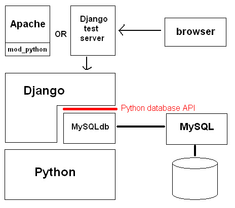
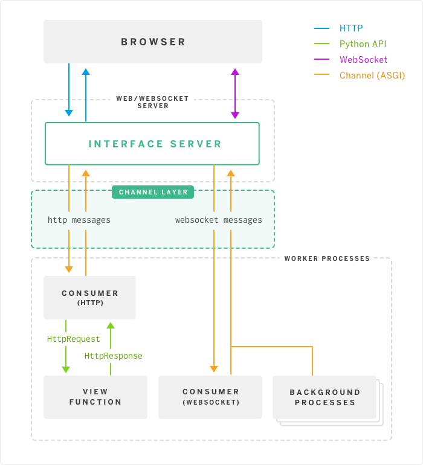

# web架构的选择

* 最早的软件都是运行在大型机上的，软件使用者通过“哑终端”登陆到大型机上去运行软件。后来随着PC机的兴起，软件开始主要运行在桌面上，而数据库这样的软件运行在服务器端，这种Client/Server模式简称CS架构。

* 随着互联网的兴起，人们发现，CS架构不适合Web，最大的原因是Web应用程序的修改和升级非常迅速，而CS架构需要每个客户端逐个升级桌面App，因此，Browser/Server模式开始流行，简称BS架构。

* 在BS架构下，客户端只需要浏览器，应用程序的逻辑和数据都存储在服务器端。浏览器只需要请求服务器，获取Web页面，并把Web页面展示给用户即可。当然，Web页面也具有极强的交互性。由于Web页面是用HTML编写的，而HTML具备超强的表现力，并且，服务器端升级后，客户端无需任何部署就可以使用到新的版本，因此，BS架构迅速流行起来。

* 今天，除了重量级的软件如Office，Photoshop等，大部分软件都以Web形式提供。比如，新浪提供的新闻、博客、微博等服务，均Web应用

# WEB开发技术
Web应用开发可以说是目前软件开发中最重要的部分。Web开发也经历了好几个阶段：

* 静态Web页面：由文本编辑器直接编辑并生成静态的HTML页面，如果要修改Web页面的内容，就需要再次编辑HTML源文件，早期的互联网Web页面就是静态的；

* CGI：由于静态Web页面无法与用户交互，比如用户填写了一个注册表单，静态Web页面就无法处理。要处理用户发送的动态数据，出现了Common Gateway Interface，简称CGI，用C/C++编写。

* ASP/JSP/PHP：由于Web应用特点是修改频繁，用C/C++这样的低级语言非常不适合Web开发，而脚本语言由于开发效率高，与HTML结合紧密，因此，迅速取代了CGI模式。ASP是微软推出的用VBScript脚本编程的Web开发技术，而JSP用Java来编写脚本，PHP本身则是开源的脚本语言。

* MVC：为了解决直接用脚本语言嵌入HTML导致的可维护性差的问题，Web应用也引入了Model-View-Controller的模式，来简化Web开发。ASP发展为ASP.Net，JSP和PHP也有一大堆MVC框架。

目前，Web开发技术仍在快速发展中，异步开发、新的MVVM前端技术层出不穷。

## MVC 架构

MVC全名是Model View Controller，是模型(model)－视图(view)－控制器(controller)的缩写，一种软件设计典范，用一种业务逻辑、数据、界面显示分离的方法组织代码，将业务逻辑聚集到一个部件里面，在改进和个性化定制界面及用户交互的同时，不需要重新编写业务逻辑。MVC被独特的发展起来用于映射传统的输入、处理和输出功能在一个逻辑的图形化用户界面的结构中。

*  参考阅读1：[谈谈MVC模式](http://www.ruanyifeng.com/blog/2007/11/mvc.html)

## django框架 :Python web框架

Django是一个开放源代码的Web应用框架，由Python写成。采用了MVC的框架模式，即模型M，视图V和控制器C。这套框架是以比利时的吉普赛爵士吉他手Django Reinhardt来命名的。

Django 框架的核心组件有：
* 用于创建模型的对象关系映射
* 为最终用户设计的完美管理界面
* 一流的 URL 设计
* 设计者友好的模板语言
* 缓存系统。

### django的MVC定义

### WSGI接口
WSGI是Web Server Gateway Interface的缩写，是Python应用程序或框架和Web服务器之间的一种接口，
已经被广泛接受, 它已基本达成它的可移植性方面的目标。

WSGI是作为Web服务器与Web应用程序或应用框架之间的一种低级别的接口，以提升可移植Web应用开发的共同点。WSGI是基于现存的[[CGI]]标准而设计的。

### django的架构

### django的文件对应概念

### websocket

因为 HTTP 协议有一个缺陷：通信只能由客户端发起。举例来说，我们想了解今天的天气，只能是客户端向服务器发出请求，服务器返回查询结果。HTTP 协议做不到服务器主动向客户端推送信息。这种单向请求的特点，注定了如果服务器有连续的状态变化，客户端要获知就非常麻烦。我们只能使用"轮询"：每隔一段时候，就发出一个询问，了解服务器有没有新的信息。最典型的场景就是聊天室。
轮询的效率低，非常浪费资源（因为必须不停连接，或者 HTTP 连接始终打开） 。因此，工程师们一直
在思考，有没有更好的方法。WebSocket 就是这样发明的。

参考阅读1：[为什么需要websocket协议](http://www.ruanyifeng.com/blog/2017/05/websocket.html)

### JSON数据格式

JSON(JavaScript Object Notation, JS 对象简谱) 是一种轻量级的数据交换格式。它基于 ECMAScript (欧洲计算机协会制定的js规范)的一个子集，采用完全独立于编程语言的文本格式来存储和表示数据。
简洁和清晰的层次结构使得 JSON 成为理想的数据交换语言。 
易于人阅读和编写，同时也易于机器解析和生成，并有效地提升网络传输效率。

