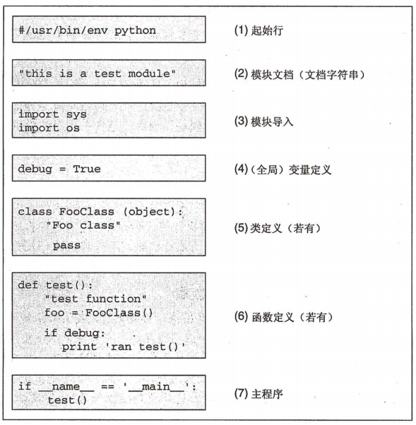

#  一个Python文件（*.py）的结构

那么我们平常新建文件的时候，都是建一个.py文件（类似Java，但是python不用建立类，是以模块为载体）至于怎样组织包就要功能需要了

在C/C++/Java中，main是程序执行的起点，Python中，也有类似的运行机制，但方式却截然不同：Python使用缩进对齐组织代码的执行，
所有没有缩进的代码（非函数定义和类定义），都会在载入时自动执行，这些代码，可以认为是Python的main函数。

每个文件（模块）都可以任意写一些没有缩进的代码，并且在载入时自动执行，为了区分主执行文件还是被调用的文件，
Python引入了一个变量__name__，当文件是被调用时，__name__的值为模块名，当文件被执行时，__name__为'__main__'。
这个特性，为测试驱动开发提供了极好的支持，我们可以在每个模块中写上测试代码，这些测试代码仅当模块被Python直接
执行时才会运行，代码和测试完美的结合在一起。

典型的Python文件结构：

